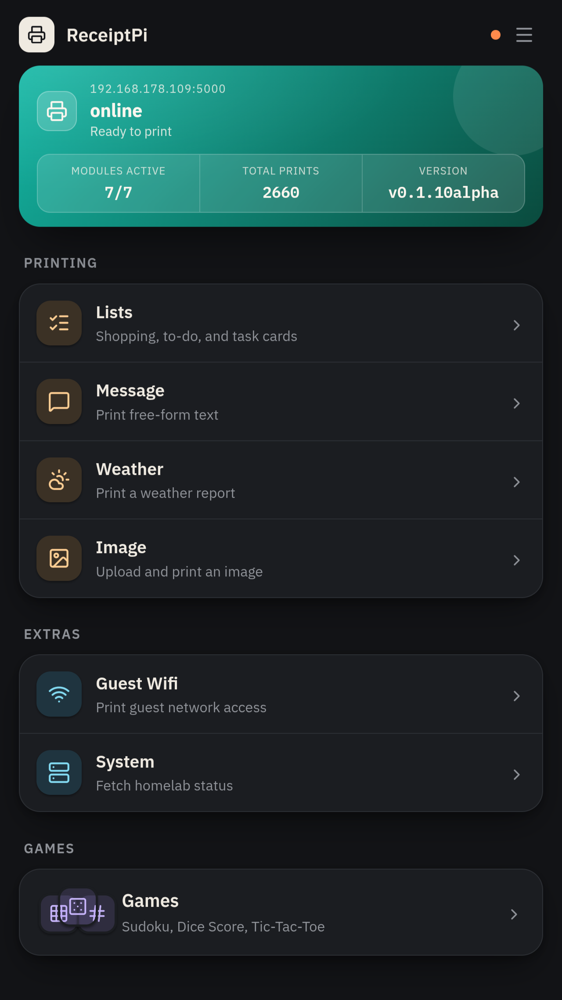

<p align="center">
  
</p>

<p align="center">
  <a href="LICENSE"></a>
  
  
  
  
</p>

<p align="center">
  <a href="#features">Features</a> •
  <a href="#quick-start">Quick Start</a> •
  <a href="#roadmap">Roadmap</a> •
  <a href="../../issues">Issues</a>
</p>

# ReceiptPi

*[English version](README.md)*

Flask-Server für einen ESC/POS-Thermodrucker (getestet mit Epson TM-T88V) an
einem Raspberry Pi Zero (2) W. Mobile Web-UI (Deutsch/Englisch) zum Drucken
von Einkaufszetteln, Statusmeldungen, Wetterberichten, Bildern und
Systemberichten – jede Druckart optional mit vorangestelltem kleinen Logo –
plus einem generischen Automation-Webhook (kompatibel mit Home Assistant,
Node-RED, n8n oder jedem Tool, das einen HTTP-POST absetzen kann) und
weiteren Automations-Triggern (GitHub-Stars, Fritz!Box-Gästenetz,
Zabbix-Webhooks für PBS-Fehler).

<p align="center">
  <a href="assets/home.png">
    
  </a>
</p>

## Schnellstart

```bash
python3 -m venv .venv
source .venv/bin/activate
pip install -r requirements.txt

cp config.example.py config.py
# config.py mit echten Werten füllen (HA-Token, Netatmo-Entities, Fritz!Box-Zugang, ...)

python3 app.py
```

Server läuft dann auf Port 5000, Web-UI unter `http://<pi-hostname>:5000`.
`python3 app.py` nutzt den Flask-Entwicklungsserver – für den Dauerbetrieb
läuft der Service stattdessen über Gunicorn mit `gunicorn.conf.py` und genau einem Worker, da die Print-Queue prozesslokal arbeitet.

Die meisten Einstellungen (Ruhezeit-Regeln, Wetter-Standorte, beobachtete
GitHub-Repos, SSH-Ziele für den Systembericht, Logos je Druckart,
UI-Sprache) werden komplett über die Settings-Seite der Web-UI verwaltet –
dafür muss `config.py` nicht angefasst werden. Nur Bootstrap-Werte
(Secret Key, API-Token, Drucker-USB-IDs, echte Zugangsdaten wie
HA-Token oder Fritz!Box-Passwort) bleiben in `config.py`, da ReceiptPi
aktuell keinen Login/Auth-Schutz für die Web-UI selbst hat.

## Struktur

```
receiptpi/
├── app.py                 Flask-App erzeugen, Blueprints registrieren
├── gunicorn.conf.py       on_starting-Hook für den Boot-Gruß
├── print_queue.py         zentrale Druck-Queue + Druckregeln-Prüfung
├── printer.py             Drucker-Hardware-Zugriff (USB)
├── security.py            CSRF-Schutz, API-Token-Schutz, JSON-Parsing
├── settings_store.py      zentrale Settings (JSON in STATE_DIR, nicht im Projektordner)
├── history_store.py       SQLite-Druckhistorie (STATE_DIR), Auto-Pruning nach 180 Tagen
├── logos.py                Logo-Auflösung je Druckart, Upload-Validierung, Seeding
├── i18n.py                 minimales Übersetzungs-Lookup (JSON-Dateien, kein Flask-Babel)
├── config.example.py       Vorlage für config.py (lokal ausfüllen)
├── modules/
│   ├── shopping/            Einkaufszettel
│   ├── message/               Statusmeldungen (freier Titel + Text)
│   ├── images/                Bilder drucken
│   ├── wifi/                  Gäste-WLAN-Zettel (Text + QR-Code)
│   ├── weather/                Wetterbericht (DWD + Netatmo)
│   ├── system/                 Systembericht (Proxmox/PBS/piNAS via SSH)
│   ├── automation/            generischer Automation-Webhook
│   ├── history/                Druckhistorie-Dashboard
│   └── settings/                Settings-Seiten (Web-UI) + Settings-API
├── watchers/
│   ├── github_star_watch.py     Cron: druckt bei neuem GitHub-Star
│   ├── fritzbox_wifi_watch.py    Cron: druckt WLAN-Zettel bei aktiviertem Gästenetz
│   └── storm_warning_watch.py    Cron: druckt bei neuer aktiver Unwetterwarnung
├── assets/example-logos/    mitgelieferter Logo-Startsatz (Strichzeichnungen)
└── templates/                gemeinsames Layout und Modul-Seiten
    ├── base.html
    ├── home.html
    ├── shopping.html
    ├── message.html
    ├── images.html
    ├── wifi.html
    ├── weather.html
    ├── system.html
    ├── history.html
    └── settings_*.html        Settings-Übersicht + eine Unterseite je Bereich
```

Jede Funktion ist als eigener Flask-Blueprint umgesetzt. Nicht abgefangene Ausnahmen betreffen nur den jeweiligen Request; die Module teilen sich weiterhin Prozess, Druck-Queue und Settings-Store.

## Settings-Seiten

`/settings` ist eine Übersichtsseite (Kachel-Grid), die auf eine eigene Unterseite pro Bereich verlinkt – statt eines langen Formulars:

- `/settings/language` – UI-Sprache (Deutsch/Englisch)
- `/settings/print-rules` – Ruhezeit-Regeln (mehrere unabhängige Regeln, je mit eigenen Wochentagen und Zeitfenster) + Rate-Limit + Duplikat-Sperre
- `/settings/weather` – Wetterbericht-Anbieter (DWD oder Open-Meteo), Wetter-Standorte, sowie ein unabhängiger Unwetterwarnungs-Anbieter (DWD, MeteoAlarm oder NWS) mit eigenem Aktiv-Schalter und optionalem "Ruhezeiten ignorieren"
- `/settings/system-report` – SSH-Ziele für den Systembericht (Proxmox/piNAS/PBS)
- `/settings/github-watch` – beobachtete GitHub-Repos
- `/settings/logos` – globaler Logo-Schalter, Standard-Logo, sowie je Druckart eigener Schalter/Upload/Vorschau (fällt auf das Standard-Logo zurück, wenn kein eigenes gesetzt ist)

## Endpunkte

Alle `/print/*`- und `/settings/*`-Endpunkte verlangen den Header
`X-Api-Token: <wert>`, sobald `API_TOKEN` in `config.py` gesetzt ist (leer = kein Schutz).
Vor jedem Druckauftrag greifen zusätzlich die zentralen Druckregeln: Ruhezeiten, Rate-Limit und Duplikat-Sperre.
Ein blockierter Auftrag antwortet mit `429`.

**Drucken**
- `POST /print/message` – `{ "title": "...", "text": "..." }`
- `POST /print/list` – `{ "title": "...", "items": ["..."] }`
- `POST /print/image` – Multipart-Upload (max. 12000px pro Seite, 12MB)
- `POST /print/wifi` – `{ "ssid": "...", "password": "...", "auth_type": "WPA" }`
- `POST /print/weather` – optional `{ "location": "Berlin" }`, sonst Standard-Standort
- `POST /print/system` – kein Body nötig
- `POST /print/automation` – `{ "title": "optional", "text": "..." }` – generischer Automation-Webhook (kompatibel mit Home Assistant, Node-RED, n8n oder jedem Tool, das HTTP-POST beherrscht)
- `GET /health` – Drucker-Erreichbarkeit prüfen (kein Token nötig, läuft aber über dieselbe Queue; nicht Teil der Druckhistorie)

**Settings-API**
- `GET /settings/api` – aktuelle Druckregeln + Wetter-Standorte (JSON)
- `POST /settings/print_rules` – Rate-Limit/Duplikat-Fenster ändern
- `GET|POST /settings/quiet_hours/rules`, `POST /settings/quiet_hours/rules/<id>/toggle`, `DELETE /settings/quiet_hours/rules/<id>`
- `GET|POST /settings/weather/locations`, `DELETE /settings/weather/locations/<name>`
- `GET|POST /settings/system_report` – SSH-Ziele für den Systembericht
- `GET|POST /settings/github_watch/repos`, `DELETE /settings/github_watch/repos/<owner>/<repo>`
- `GET|POST /settings/logos/config` – globale/pro Modul Logo-Schalter
- `POST /settings/logos/upload/<slot>`, `DELETE /settings/logos/upload/<slot>` – Logo-Bild hochladen/löschen (base64), `slot` ist `default` oder ein Modul-Key

## Nach der Installation

```bash
pip freeze > requirements.lock.txt
```
Friert die tatsächlich installierten Versionen ein – `requirements.txt`
selbst bleibt bewusst unversioniert, `requirements.lock.txt` dient nur als
Referenz, falls ein Update mal etwas kaputt macht.

## Aktuelle Module

- Einkaufslisten
- Freie Textmeldungen
- Bild-Upload und Bilddruck per API
- Gäste-WLAN-Zugangsdaten und QR-Codes
- Wetterberichte (DWD oder Open-Meteo wählbar, + optional Netatmo), mit optionalem Unwetterwarnungs-Watcher (DWD, MeteoAlarm oder NWS, druckt nur bei tatsächlich aktiver Warnung)
- Systemberichte (Proxmox/piNAS/PBS via SSH)
- Druckhistorie-Dashboard (Statistik + paginierte Liste, SQLite-basiert)
- Optionale Logos je Druckart mit globalem Standard-Fallback
- Webbasierte Einstellungen, aufgeteilt in Unterseiten je Bereich
- Deutsch/Englisch-UI, inklusive des eigentlichen Bon-Inhalts (nicht nur der UI drumherum)

## Roadmap

Als Nächstes geplant: ein Schriftgrößen-Umschalter (klein/mittel/groß)
für UI und Bon, NFC-Tag-ausgelöster Druck (nur eine URL im Tag, keine
App nötig), sowie ein Rezepte-Modul (Tandoor/Mealie) mit über die
Web-UI konfigurierbaren Zugangsdaten. Die
Roadmap kann sich mit weiteren Hardwaretests ändern.

## Mitwirken

Issues und Pull Requests sind willkommen. Neue Module sollen Flask-Blueprints verwenden, Druckaufträge ausschließlich über die zentrale Queue einreichen und weder direkt auf den Drucker noch auf Settings-Dateien schreiben.

## Trademark Notice

Raspberry Pi is a trademark of the Raspberry Pi Foundation. This project is
not affiliated with, endorsed by, or sponsored by the Raspberry Pi
Foundation.

Epson and TM-T88V are trademarks of Seiko Epson Corporation. This project is
not affiliated with, endorsed by, or sponsored by Epson.

ReceiptPi is an independent, community-built project designed to run on
Raspberry Pi hardware and to be compatible with Epson ESC/POS thermal
printers.

## Lizenz

MIT – siehe [LICENSE](LICENSE).
